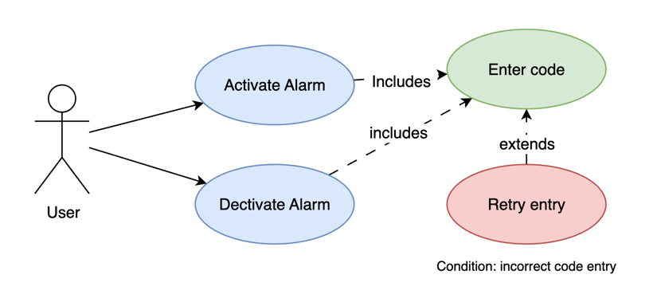

### Exercise 3 -- Identifying Requirement Defects
- R1. The security alarm has a detector that sends a trip signal when motion is detected.
- R2. The security alarm is activated by pressing the Set button.
- R3. The Set button is illuminated when the security alarm is set.
- R4. If a trip signal occurs while the security alarm is set, a high-pitched tone (alarm) is emitted.
- R5. A three-digit code must be entered to turn off the alarm tone.
- R6. Correct entry of the code deactivates the security alarm.
- R7. If a mistake is made when entering the code, the user must press the Clear button before the
code can be reentered

## Task
- You should identify at least 10
additional defects beyond the examples provided

| defectId | reqId | defectDescription                                                                                                                      | defectType               |
|:--------:|:-----:|:---------------------------------------------------------------------------------------------------------------------------------------|:-------------------------|
|    d1    |  r1   | Does not specify where the trip signal is sent                                                                                         | Incompleteness           |
|    d2    |  r1   | Missing precondition; does not state alarm status                                                                                      | Incompleteness           |
|    d3    | r4,r5 | Unclear if high-pitched tone and alarm tone are the same                                                                               | Ambiguity/Inconsistency  |
|    d4    | r2,r6 | Does not specify if the code needed to activate the alarm.                                                                             | Inconsistency            |
|    d5    |  r3   | Does not specify what illuminated means, does it flash or glow, what color?                                                            | Ambiguity                |
|    d6    |  r2   | Does not specify where is the button located, what input device?                                                                       | incompleteness           |
|    d7    | r5,r6 | Does the code entry turn off the tone or the alarm, when triggered                                                                     | Ambiguity/Redundancy     |
|    d8    |  r5   | Where is the code entered? what is the input device?                                                                                   | Incompleteness           |
|    d9    |  r1   | How long does it play for? Does it stop on it's own or loop until deactivated?                                                         | Incompleteness           |
|   d10    |  r1   | What if new signal is detected while it's on? Is it ignored or is the alarm triggered again?                                           | Incompleteness           |
|   d11    |  r2   | Is there a buffer time for user to leave before it activates?                                                                          | Incompleteness           |
|   d12    |  r7   | How does user know a mistake has been made? Does it play some tone, or flash light?                                                    | Incompleteness           |
|   d13    |  r7   | Is there an attempt limit or a cooldown? Can the user/intruder be picking up the digits indefinitely?                                  | Incompleteness           |
|   d14    |  r6   | Is there a specific indicator of correct input? What if the input was wrong, but the alarm stopped because of the time out?            | Incompleteness/Ambiguity |
|   d15    |  r1   | Does the system call the security/police when the tone goes off or does it send notifications to the owner? What are the next actions? | Incompleteness           |
|   d16    |  r1   | Is there a buffer time to enter the code by the user if triggerred by accident before the services are involved?                       | Incompleteness           |

### Exercise 4 -- Writing High-quality Requirements
Requirement rules:
- Precondition
- Event (and/or Action)
- Postcondition
- Constraints (if applicable)
Also
- Single, specific concept per requirement
- No multiple terms for a single concept.

### Task: 
Rewrite the security alarm requirements from the previous exercise using this pattern. You may add reasonable assumptions to fill in missing details. Put any added information in brackets [ ... ] to indicate that it is analyst-supplied and should be validated with the customer.

#### R1:
- Precondition: The security alarm is set.
- Event: The detector identifies motion.
- Postcondition: A trip signal is sent to [ the security center ].
- Constraints: [ The trip signal must be sent within three seconds ].

#### R2:
- Precondition: The security alarm is inactive.
- Event: [ User inputs the code ] and presses the set button [ on the input keyboard ] to activate the alarm.
- Postcondition: [ System validates the input and signifies with sound and red/green light if the code has been accepted, activates the motion sensor]
- Constraints: [ The activation happens after a fixed short period of time, to allow the user to leave the premises without triggering ]

#### R3:
- Precondition: The alarm is set.
- Event: The set button [on the input device] is illuminated [ with blinking yellow light]
- Postcondition: [User knows the system in active by looking at the light through the window/door/during timeout to leave after activation.]
- Constraints: [ The light signals follow documented patterns to prevent confusion / demonstrate consistency ]

#### R4:
- Precondition: a trip signal occurs while the alarm is set
- Event: A [distinct] high-pitched tone (alarm) is emitted [on the premises via the set of system sound devices].
- Postcondition: [ The trip signal is sent to security services ]
- Constraints: [ The sound signals follow documented patterns to prevent confusion / demonstrate consistency ]

#### R5:
- Precondition: The alarm is triggered.
- Event: A three-digit code is entered [by the user]
- Postcondition: The alarm tone is disabled, [system is still set]
- Constraints: [ only three attempts are allowed, then only the response group can disable it ], [system uses design patterns to show the input status]

#### R6:
- Precondition: The alarm is triggered
- Event: User inputs the code correctly [indicated by the system]
- Postcondition: The alarm is deactivated 
- Constraints: [ The code was spelled right within 3 attempts ]

#### R2:
- Precondition: The alarm is set, mistake has been made while entering the code
- Event: User presses "Clear" button before reentering the code
- Postcondition: [System plays tone and allows another attempt]
- Constraints: [ Three attempts ]

### Exercise 5 -- Creating a Use Case Diagram UML compliant

1. Identify Actors
   - User
   - Security center
   - Technician
    
2. Identify Use Cases
   - Activate Alarm
   - Deactivate Alarm

3. Use <<include>> / <<extend>> relationship where common functionality is shared between use cases 
   
   Activate Alarm:
   - <<include>> enter the code
   - <<include>> system lights red
     - <<extend>> clear input and retry
   - <<include>> system lights green
   - Alarm is activated

   Deactivate Alarm:
   - <<include>> enter the code
   - <<include>> system lights red
     - <<extend>> clear input and retry
   - <<include>> system lights green
   - Alarm is activated

4. Draw Diagram
